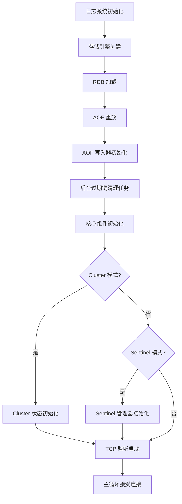

# redis-rust 服务器生命周期文档

> 本文档详细描述了 redis-rust 项目的启动流程、连接处理机制和关闭流程。
> 面向希望理解和维护本项目的开发者。
>
> **关键源文件引用**：
> - `src/main.rs` — 程序入口与启动 orchestration
> - `src/server/mod.rs` — `Server` 结构体与 Builder 模式
> - `src/server/connection.rs` — 连接处理主循环
> - `src/storage/mod.rs` — 存储引擎与分片策略
> - `src/storage/key_ops.rs` — 过期键清理任务
> - `src/rdb.rs` — RDB 快照持久化
> - `src/aof.rs` — AOF 日志持久化
> - `src/pubsub.rs` — 发布订阅管理器
> - `src/acl.rs` — ACL 权限管理
> - `src/replication.rs` — 主从复制管理
> - `src/cluster/` — Cluster 模式相关模块
> - `src/sentinel/` — Sentinel 模式相关模块

---

## 1. 概述

redis-rust 是一个使用 **Rust** 语言编写的 Redis 兼容服务器实现。它基于 **Tokio** 异步运行时构建，能够高效地处理大量并发客户端连接。

本项目支持的运行模式包括：

| 运行模式 | 启动参数 | 说明 |
|---------|---------|------|
| 独立模式（Standalone） | 默认 | 单节点运行，支持完整的 Redis 命令集 |
| Sentinel 模式 | `--sentinel` | 高可用监控，自动故障检测与转移 |
| Cluster 模式 | `--cluster-enabled yes` | 分布式集群，数据分片与自动故障转移 |

---

## 2. 命令行参数

服务器通过 `std::env::args()` 手动解析命令行参数，解析逻辑位于 **`src/main.rs` 第 37-56 行**：

```rust
let mut port = DEFAULT_PORT;
let mut no_aof = false;
let mut sentinel_mode = false;
let mut cluster_enabled = false;
let mut args = std::env::args().skip(1);
while let Some(arg) = args.next() {
    if arg == "--port" {
        if let Some(p) = args.next() {
            port = p.parse().unwrap_or(DEFAULT_PORT);
        }
    } else if arg == "--no-aof" {
        no_aof = true;
    } else if arg == "--sentinel" {
        sentinel_mode = true;
    } else if arg == "--cluster-enabled"
        && let Some(val) = args.next() {
            cluster_enabled = val.eq_ignore_ascii_case("yes");
        }
}
// Sentinel 模式下默认端口为 26379
if sentinel_mode && port == DEFAULT_PORT {
    port = SENTINEL_DEFAULT_PORT;
}
```

### 参数详细说明

| 参数 | 类型 | 默认值 | 说明 |
|-----|------|-------|------|
| `--port <PORT>` | `u16` | `6379`（Sentinel 模式下为 `26379`） | 服务器监听的 TCP 端口 |
| `--no-aof` | 标志 | 禁用 | 禁用 AOF（Append Only File）持久化 |
| `--sentinel` | 标志 | 禁用 | 启用 Sentinel 高可用监控模式 |
| `--cluster-enabled yes\|no` | 字符串 | `no` | 启用 Cluster 分布式集群模式 |

**设计说明**：当前参数解析采用简单的手动迭代方式，而非使用 `clap` 等解析库，这是为了减少外部依赖。参数顺序不敏感，但 `--cluster-enabled` 必须后跟一个值（`yes` 或 `no`，不区分大小写）。

---

## 3. 启动流程

服务器的启动流程按严格顺序执行，以下按时间线逐步说明每个阶段。

### 启动流程总览



### 3.1 日志系统初始化

**代码位置**：`src/main.rs` 第 35 行

```rust
env_logger::init();
```

启动流程的第一步是初始化 `env_logger`。日志级别通过 `RUST_LOG` 环境变量控制，例如：

```bash
RUST_LOG=info cargo run
RUST_LOG=debug cargo run -- --port 6380
```

支持的日志级别遵循 `log` crate 的标准：`error`、`warn`、`info`、`debug`、`trace`。

### 3.2 存储引擎创建

**代码位置**：`src/main.rs` 第 70 行

```rust
let storage = StorageEngine::new();
```

`StorageEngine::new()` 在 `src/storage/mod.rs` 第 262-273 行实现，创建包含以下内容的存储引擎：

- **16 个独立数据库**：对标 Redis 默认的 16 个 DB（索引 0-15）。
- **分片哈希表（ShardedMap）**：每个数据库内部使用 **64 个分片**的 `RwLock<HashMap<String, StorageValue>>`。
- **版本号表（ShardedVersions）**：同样 64 分片，用于 `WATCH`/`MULTI`/`EXEC` 事务的乐观锁。
- **访问时间/计数**：用于 LRU/LFU 内存淘汰策略。
- **阻塞等待者表**：用于 `BLPOP`/`BRPOP` 等阻塞操作。
- **Hash 字段级过期表**：支持 `HEXPIRE`/`HPEXPIRE` 的字段级过期。

#### 分片策略的优势

分片策略的核心在于将全局锁拆分为 64 个独立的读写锁：

```rust
const NUM_SHARDS: usize = 64;

pub struct ShardedMap {
    shards: Vec<RwLock<HashMap<String, StorageValue>>>,
}

impl ShardedMap {
    pub fn get_shard(&self, key: &str) -> &RwLock<HashMap<String, StorageValue>> {
        let mut hasher = DefaultHasher::new();
        key.hash(&mut hasher);
        let hash = hasher.finish() as usize;
        &self.shards[hash % NUM_SHARDS]
    }
}
```

**优势**：
1. **并发度提升**：不同 key 如果映射到不同分片，读写操作可以真正并行。
2. **减少锁竞争**：相比全局的单个 `RwLock<HashMap>`，64 分片将竞争概率降低到约 1/64。
3. **读多写少场景友好**：`RwLock` 允许多个读操作并发，适合 Redis 典型的读多写少工作负载。

### 3.3 持久化数据恢复

这是启动流程中最关键的部分，直接决定了服务器启动后的数据状态。

#### 3.3.1 RDB 加载

**代码位置**：`src/main.rs` 第 73-83 行

```rust
let rdb_repl_info = match redis_rust::rdb::load(&storage, RDB_PATH) {
    Ok((replid, offset)) => {
        info!("RDB 快照加载成功");
        (replid, offset)
    }
    Err(e) => {
        log::debug!("RDB 加载跳过: {}", e);
        (None, None)
    }
};
```

RDB 加载逻辑在 `src/rdb.rs` 中实现。文件格式如下：

| 字段 | 长度 | 说明 |
|-----|------|------|
| 魔数 | 10 字节 | `REDIS-RUST`（ASCII） |
| 版本号 | 4 字节（u32 BE） | 当前为 `1` |
| 数据库段 | 变长 | 每个 DB 的 key-value 数据 |
| AUX 段 | 变长 | 复制信息（`repl-id`、`repl-offset`） |
| EOF 标记 | 1 字节 | `0xFF` |
| CRC32 | 4 字节（u32 BE） | 整文件校验 |

**关键行为**：
- 加载过程会**过滤已过期**的 key（根据 `ExpiringString` 中的 `expire_at` 字段与当前系统时间对比）。
- 返回 `(Option<String>, Option<i64>)` 元组，即 `(replid, offset)`，用于后续恢复复制状态。
- 如果 `dump.rdb` 文件不存在，**仅记录 debug 日志，不报错**——这是首次启动的正常情况。

#### 3.3.2 AOF 重放

**代码位置**：`src/main.rs` 第 86-89 行

```rust
if !no_aof
    && let Err(e) = AofReplayer::replay(AOF_PATH, storage.clone()) {
        log::error!("AOF 重放失败: {}", e);
    }
```

AOF 重放逻辑在 `src/aof.rs` 第 88-120 行实现。

**混合格式支持**：

AOF 文件可能以特殊头部 `REDIS-RUST-AOF-PREAMBLE\n` 开头，表示这是一个**混合格式**文件（RDB 前导 + AOF 命令）：

```rust
if content.starts_with(AOF_RDB_PREAMBLE) {
    log::info!("检测到混合格式 AOF 文件，先加载 RDB 快照");
    let rdb_start = AOF_RDB_PREAMBLE.len();
    let mut cursor = std::io::Cursor::new(&content[rdb_start..]);
    let _ = crate::rdb::load_from_reader(&storage, &mut cursor, false)?;

    let rdb_consumed = cursor.position() as usize;
    let aof_data = &content[rdb_start + rdb_consumed..];
    Self::replay_raw_aof(aof_data, storage)?;
    return Ok(());
}
```

**纯 AOF 格式**：

如果文件不以混合格式头部开头，则直接将整个文件作为 RESP 编码的命令序列进行重放：

```rust
fn replay_raw_aof(data: &[u8], storage: StorageEngine) -> Result<()> {
    let parser = RespParser::new();
    let cmd_parser = CommandParser::new();
    let executor = CommandExecutor::new(storage); // 重放时不使用 AOF writer

    let mut buf = BytesMut::from(data);
    let mut count = 0usize;
    let mut errors = 0usize;

    while !buf.is_empty() {
        match parser.parse(&mut buf) {
            Ok(Some(resp)) => {
                match cmd_parser.parse(resp) {
                    Ok(cmd) => {
                        match executor.execute(cmd) {
                            Ok(_) => count += 1,
                            Err(e) => { log::warn!("AOF 重放命令执行失败: {}", e); errors += 1; }
                        }
                    }
                    Err(e) => { log::warn!("AOF 重放命令解析失败: {}", e); errors += 1; }
                }
            }
            Ok(None) => { break; } // 文件末尾数据不完整
            Err(e) => { log::error!("AOF 重放 RESP 解析失败: {}", e); break; }
        }
    }

    log::info!("AOF 重放完成，成功: {} 条，失败: {} 条", count, errors);
    Ok(())
}
```

**注意**：重放时使用的是 `CommandExecutor::new(storage)`（无 AOF），这是为了避免循环写入 AOF 文件。

#### 3.3.3 恢复顺序的设计

启动时**先加载 RDB，再重放 AOF**，这个顺序至关重要：

1. **RDB 是基线快照**：提供了某个时间点的完整数据状态。
2. **AOF 是增量命令**：记录了 RDB 生成之后的所有写操作。
3. **数据完整性**：AOF 中的命令会覆盖 RDB 中相同 key 的值，确保最终状态是最新的。

这与 Redis 原生行为一致：`AOF` 的优先级高于 `RDB`。

### 3.4 AOF 写入器初始化

**代码位置**：`src/main.rs` 第 92-96 行

```rust
let aof = if no_aof {
    None
} else {
    Some(Arc::new(Mutex::new(AofWriter::new(AOF_PATH)?)))
};
```

`AofWriter` 在 `src/aof.rs` 第 19-73 行定义：

```rust
pub struct AofWriter {
    writer: BufWriter<File>,
    path: String,
}

impl AofWriter {
    pub fn new(path: &str) -> Result<Self> {
        let file = OpenOptions::new()
            .create(true)
            .append(true)
            .open(path)
            .map_err(AppError::Io)?;
        Ok(Self {
            writer: BufWriter::new(file),
            path: path.to_string(),
        })
    }

    pub fn append(&mut self, cmd: &Command) -> Result<()> {
        let resp = cmd.to_resp_value();
        let parser = RespParser::new();
        let encoded = parser.encode(&resp);
        self.writer.write_all(&encoded).map_err(AppError::Io)?;
        Ok(())
    }

    pub fn flush(&mut self) -> Result<()> {
        self.writer.flush().map_err(AppError::Io)
    }

    pub fn reopen(&mut self) -> Result<()> {
        // AOF 重写后切换新文件
        let file = OpenOptions::new().create(true).append(true).open(&self.path)?;
        self.writer = BufWriter::new(file);
        Ok(())
    }
}
```

**关键设计**：
- 使用 `BufWriter<File>` 进行缓冲写入，减少系统调用次数。
- 包装在 `Arc<Mutex<>>` 中，因为多个连接可能并发执行写命令，都需要追加到同一 AOF 文件。
- `reopen()` 方法用于 `BGREWRITEAOF` 完成后切换到新的 AOF 文件。

### 3.5 后台过期键清理任务

**代码位置**：`src/main.rs` 第 99 行；`src/storage/key_ops.rs` 第 302-316 行

```rust
let _cleanup_handle = storage.start_cleanup_task(CLEANUP_INTERVAL_MS);
```

`start_cleanup_task` 的实现：

```rust
pub fn start_cleanup_task(&self, interval_ms: u64) -> tokio::task::JoinHandle<()> {
    let storage = self.clone();
    tokio::spawn(async move {
        let mut interval = tokio::time::interval(
            tokio::time::Duration::from_millis(interval_ms),
        );
        loop {
            interval.tick().await;
            if let Err(e) = storage.cleanup_expired_keys() {
                log::error!("后台清理过期键失败: {}", e);
            }
        }
    })
}
```

清理逻辑 `cleanup_expired_keys`：

```rust
fn cleanup_expired_keys(&self) -> Result<()> {
    if !self.active_expire_enabled.load(Ordering::SeqCst) {
        return Ok(());
    }
    let db = self.db();
    for shard in db.inner.all_shards() {
        let mut map = shard.write().map_err(|e| AppError::Storage(format!("锁中毒: {}", e)))?;
        let expired_keys: Vec<String> = map
            .iter()
            .filter(|(_, v)| Self::is_expired(v))
            .map(|(k, _)| k.clone())
            .collect();
        for key in expired_keys {
            map.remove(&key);
        }
    }
    Ok(())
}
```

**设计要点**：
- 执行间隔：**1000 毫秒**（即每秒一次）。
- 在 `tokio::spawn` 中运行的**无限循环**，错误仅记录日志，不中断任务。
- 可以通过 `DEBUG SET-ACTIVE-EXPIRE 0` 命令禁用主动过期清理（用于调试）。
- 属于**主动过期**策略，与**惰性过期**（访问 key 时才检查是否过期）互补。

### 3.6 核心组件初始化

在存储引擎和持久化恢复完成后，按顺序初始化以下核心组件：

#### PubSubManager（发布/订阅系统）

**代码位置**：`src/main.rs` 第 103 行；`src/pubsub.rs`

```rust
let pubsub = PubSubManager::new();
```

基于 `tokio::sync::broadcast` 频道实现，支持：
- 精确频道订阅（`SUBSCRIBE`/`UNSUBSCRIBE`）
- 模式订阅（`PSUBSCRIBE`/`PUNSUBSCRIBE`）
- 分片频道订阅（`SSUBSCRIBE`/`SUNSUBSCRIBE`）

#### AclManager（访问控制列表）

**代码位置**：`src/main.rs` 第 106 行；`src/acl.rs`

```rust
let acl = AclManager::new();
```

默认创建 `default` 用户，该用户：
- `enabled = true`
- `nopass = true`（无需密码）
- `commands = AllCommands`
- `keys = AllKeys`
- `channels = AllChannels`

即**默认情况下没有任何访问限制**。可通过 `ACL SETUSER` 命令配置细粒度权限。

#### ReplicationManager（主从复制）

**代码位置**：`src/main.rs` 第 109-115 行；`src/replication.rs`

```rust
let replication = Arc::new(ReplicationManager::new());

if let (Some(replid), Some(offset)) = rdb_repl_info {
    replication.set_replid_and_offset(replid, offset);
    info!("从 RDB 恢复复制信息: replid={}, offset={}", ...);
}
```

- 初始角色为 **Master**，自动生成 40 字符的随机十六进制 `replid`。
- 如果 RDB 文件中包含复制信息（AUX 段），调用 `set_replid_and_offset()` 恢复之前的状态，避免不必要的全量同步。
- 广播通道容量为 10,000 条消息，积压缓冲区（backlog）默认 1MB。

### 3.7 Cluster 模式启动

**仅在 `--cluster-enabled yes` 时执行**，代码位置：`src/main.rs` 第 118-201 行。

```rust
let cluster = if cluster_enabled {
    let c = Arc::new(redis_rust::cluster::ClusterState::new("127.0.0.1".to_string(), port));
    // 尝试加载已有拓扑
    if let Err(e) = c.load_nodes_conf("nodes.conf") {
        log::debug!("nodes.conf 加载失败或不存在: {}", e);
    } else {
        log::info!("从 nodes.conf 恢复集群拓扑");
    }
    // 启动时立即保存一次，确保文件存在
    if let Err(e) = c.save_nodes_conf("nodes.conf") {
        log::warn!("初始 nodes.conf 保存失败: {}", e);
    }
    Some(c)
} else {
    None
};
```

#### Cluster 启动后启动的后台任务

| 任务 | 代码位置 | 功能 | 频率 |
|-----|---------|------|------|
| **Cluster Bus 监听器** | `src/main.rs` 第 163-174 行 | 监听端口 = 服务端口 + 10000，处理节点间 PING/PONG/UPDATE 消息 | 持续运行 |
| **Gossip 任务** | `src/main.rs` 第 177-180 行 | 向所有已知节点发送 PING，交换拓扑信息 | 每秒一次 |
| **故障检测器** | `src/main.rs` 第 183-186 行 | 监控节点健康，标记 PFAIL/FAIL，自动故障转移 | 每秒一次 |
| **拓扑持久化** | `src/main.rs` 第 189-201 行 | 每 10 秒将集群拓扑保存到 `nodes.conf` | 每 10 秒 |

**Cluster Bus 消息格式**：

文本协议示例：
```
PONG <node_id> <ip> <port> <epoch> <flags> <master_id> [slot_ranges...]
UPDATE <node_id> <ip> <port> <epoch> <flags> <master_id> [slot_ranges...]
```

也支持基于魔数的二进制协议（`src/cluster/protocol.rs`）。

### 3.8 Sentinel 模式启动

**仅在 `--sentinel` 时执行**，代码位置：`src/main.rs` 第 136-160 行。

```rust
let sentinel = if sentinel_mode {
    let s = Arc::new(SentinelManager::new());
    if let Err(e) = s.load_config() {
        log::warn!("Sentinel 配置加载失败: {}", e);
    }
    Some(s)
} else {
    None
};
```

#### Sentinel 启动后启动的后台任务

| 任务 | 代码位置 | 功能 | 频率 |
|-----|---------|------|------|
| **监控任务** | `src/main.rs` 第 148-150 行 | PING 所有被监控的 master，每 10 秒执行 `INFO replication` 发现 replica | 每秒 / 每 10 秒 |
| **发现任务** | `src/main.rs` 第 153-155 行 | 通过 `__sentinel__:hello` 频道发布/订阅发现其他 Sentinel | 每 2 秒发布一次 |
| **ODOWN 检查器** | `src/main.rs` 第 158-160 行 | 检查 SDOWN master 是否达到 ODOWN，触发 leader 选举和故障转移 | 每秒一次 |

**Sentinel 配置**：
- 配置文件路径默认为 `sentinel.conf`。
- 通过 `SENTINEL MONITOR <name> <ip> <port> <quorum>` 命令添加监控目标。
- 配置变更时自动保存到配置文件。

### 3.9 Server 创建与 TCP 监听

**代码位置**：`src/main.rs` 第 203-214 行

```rust
let mut server = Server::new(&addr, storage, aof, pubsub, None)
    .with_rdb_path(RDB_PATH)
    .with_acl(acl)
    .with_replication(replication);
if let Some(ref c) = cluster {
    server = server.with_cluster(c.clone());
}
if let Some(s) = sentinel {
    server = server.with_sentinel(s);
}
server.run().await?;
```

`Server` 使用 **Builder 模式**配置可选组件。`Server::new()` 在 `src/server/mod.rs` 第 154-184 行：

```rust
pub fn new(
    addr: &str,
    mut storage: StorageEngine,
    aof: Option<Arc<Mutex<AofWriter>>>,
    pubsub: PubSubManager,
    password: Option<String>,
) -> Self {
    let keyspace_notifier = Arc::new(KeyspaceNotifier::new(pubsub.clone()));
    storage.set_keyspace_notifier(keyspace_notifier.clone());
    Self {
        addr: addr.to_string(),
        storage,
        aof,
        pubsub,
        password,
        clients: Arc::new(RwLock::new(HashMap::new())),
        next_client_id: Arc::new(AtomicU64::new(1)),
        script_engine: ScriptEngine::new(),
        rdb_path: None,
        slowlog: SlowLog::new(),
        acl: None,
        replication: None,
        sentinel: None,
        cluster: None,
        client_pause: Arc::new(RwLock::new(None)),
        client_kill_flags: Arc::new(Mutex::new(HashSet::new())),
        monitor_tx: tokio::sync::broadcast::channel(1024).0,
        latency: crate::latency::LatencyTracker::new(),
        keyspace_notifier,
    }
}
```

#### 主循环

`server.run()` 在 `src/server/mod.rs` 第 217-275 行：

```rust
pub async fn run(self) -> Result<()> {
    let listener = TcpListener::bind(&self.addr).await?;
    self.run_with_listener(listener).await
}

async fn run_with_listener(self, listener: TcpListener) -> Result<()> {
    log::info!("服务器已启动，等待客户端连接...");

    if let Some(ref repl) = self.replication
        && let Ok(addr) = listener.local_addr() {
            repl.set_listening_port(addr.port());
        }

    loop {
        let (stream, peer_addr) = listener.accept().await?;
        log::info!("客户端已连接: {}", peer_addr);

        // 克隆所有共享状态到连接任务
        let storage = self.storage.clone();
        let aof = self.aof.clone();
        // ... 其他字段克隆 ...

        tokio::spawn(async move {
            if let Err(e) = connection::handle_connection(
                stream, peer_addr.to_string(), storage, aof, pubsub,
                password, clients, next_client_id, script_engine, rdb_path, slowlog, acl,
                replication, sentinel, cluster, client_pause, client_kill_flags, monitor_tx, latency,
                keyspace_notifier,
            ).await {
                log::error!("处理连接 {} 时出错: {}", peer_addr, e);
            }
            log::info!("客户端已断开: {}", peer_addr);
        });
    }
}
```

**关键设计**：
- 每个客户端连接在独立的 `tokio::spawn` 任务中处理，完全异步。
- `Server` 结构体本身实现了 `Clone`，内部使用 `Arc` 共享状态，连接处理任务通过克隆获取自己的引用。
- `TcpListener::accept()` 是异步的，不会阻塞主线程。

---

## 4. 连接处理流程

### 4.1 handle_connection 函数

**代码位置**：`src/server/connection.rs` 第 502-523 行

```rust
pub(crate) async fn handle_connection(
    stream: TcpStream,
    peer_addr: String,
    mut storage: StorageEngine,
    aof: Option<Arc<Mutex<AofWriter>>>,
    pubsub: PubSubManager,
    password: Option<String>,
    clients: Arc<RwLock<HashMap<u64, ClientInfo>>>,
    next_client_id: Arc<AtomicU64>,
    script_engine: ScriptEngine,
    rdb_path: Option<String>,
    slowlog: SlowLog,
    acl: Option<crate::acl::AclManager>,
    replication: Option<Arc<crate::replication::ReplicationManager>>,
    sentinel: Option<Arc<crate::sentinel::SentinelManager>>,
    cluster: Option<Arc<crate::cluster::ClusterState>>,
    client_pause: Arc<RwLock<Option<(Instant, String)>>>,
    client_kill_flags: Arc<Mutex<HashSet<u64>>>,
    monitor_tx: tokio::sync::broadcast::Sender<String>,
    latency: crate::latency::LatencyTracker,
    keyspace_notifier: Arc<KeyspaceNotifier>,
) -> Result<()> {
```

这是连接处理的核心函数，参数非常多，因为需要访问几乎所有服务器子系统。

### 4.2 连接初始化

**代码位置**：`src/server/connection.rs` 第 524-539 行

```rust
// 分配客户端 ID
let client_id = next_client_id.fetch_add(1, Ordering::SeqCst);

// 注册客户端
{
    let mut clients_guard = clients.write().unwrap();
    clients_guard.insert(client_id, ClientInfo {
        id: client_id,
        addr: peer_addr.clone(),
        name: None,
        db: 0,
        flags: HashSet::new(),
        blocked: false,
        blocked_reason: None,
    });
}
let _client_guard = ClientGuard { client_id, clients: clients.clone() };
```

`ClientGuard` 实现了 `Drop` trait，确保连接断开时**自动从客户端注册表中移除**：

```rust
struct ClientGuard {
    client_id: u64,
    clients: Arc<RwLock<HashMap<u64, ClientInfo>>>,
}

impl Drop for ClientGuard {
    fn drop(&mut self) {
        let _ = self.clients.write().unwrap().remove(&self.client_id);
    }
}
```

### 4.3 连接状态初始化

**代码位置**：`src/server/connection.rs` 第 543-563 行

```rust
let mut authenticated = password.is_none() && acl.is_none();
let mut client_name: Option<String> = None;
let mut _current_db_index: usize = 0;
let mut current_user = "default".to_string();
let mut reply_mode = ReplyMode::On;
let mut client_flags: HashSet<String> = HashSet::new();
let blocked = false;
let _blocked_reason: Option<String> = None;
let mut replica_listening_port = 0u16;
```

- `authenticated`：如果未设置全局密码且未启用 ACL，则默认已认证。
- `reply_mode`：支持 `On`（正常回复）、`Off`（不回复）、`Skip`（跳过下一条）。
- 客户端追踪状态（`tracking_enabled` 等）：用于 `CLIENT TRACKING` 实现的键追踪缓存失效通知。

### 4.4 CommandExecutor 创建

**代码位置**：`src/server/connection.rs` 第 565-588 行

```rust
let mut executor = match aof.clone() {
    Some(aof_writer) => {
        CommandExecutor::new_with_aof(storage.clone(), aof_writer)
    }
    None => CommandExecutor::new(storage.clone()),
};
executor.set_script_engine(script_engine);
executor.set_slowlog(slowlog.clone());
executor.set_latency(latency);
if let Some(ref acl_mgr) = acl {
    executor.set_acl(acl_mgr.clone());
}
if let Some(ref repl_mgr) = replication {
    executor.set_replication(repl_mgr.clone());
}
executor.set_keyspace_notifier(keyspace_notifier.clone());
storage.set_keyspace_notifier(keyspace_notifier);
```

`CommandExecutor` 是命令执行的上下文，包含了存储引擎、AOF 写入器、脚本引擎、ACL、复制管理器等所有执行命令所需的依赖。

### 4.5 主循环

**代码位置**：`src/server/connection.rs` 第 607 行开始

```rust
loop {
    // 内层循环：处理缓冲区中所有可用命令（pipeline 支持）
    loop {
        let maybe_resp = match handler.parser.parse(&mut buf) {
            Ok(r) => r,
            Err(e) => { /* 协议错误处理 */ }
        };

        match maybe_resp {
            Some(resp_value) => {
                match handler.cmd_parser.parse(resp_value) {
                    Ok(cmd) => {
                        // 认证检查
                        // 事务模式处理
                        // ACL 权限检查
                        // CLIENT KILL 检查
                        // 客户端暂停检查
                        // Sentinel 模式命令过滤
                        // CLUSTER/SENTINEL 命令处理
                        // 普通命令执行
                    }
                    Err(e) => { /* 命令解析错误 */ }
                }
            }
            None => break, // 缓冲区数据不足，等待更多数据
        }
    }

    // 读取更多数据到缓冲区
    let n = stream.read_buf(&mut buf).await?;
    if n == 0 {
        // 连接关闭
        return Ok(());
    }
}
```

**Pipeline 支持**：内层循环会尝试从缓冲区中连续解析并执行多个完整的 RESP 消息，直到缓冲区中不再有完整消息为止。这是 Redis Pipeline 机制的基础。

### 4.6 特殊模式处理

#### 事务模式（MULTI/EXEC/DISCARD/WATCH）

**代码位置**：`src/server/connection.rs` 第 651-666 行

当 `in_transaction = true` 时，大部分命令被排队到 `tx_queue` 中，直到收到 `EXEC` 或 `DISCARD`。

#### 订阅模式

**代码位置**：`src/server/connection.rs` 第 1261-1274 行

当客户端进入订阅状态（`is_subscribed = true`）后，只允许执行 `(P|S)SUBSCRIBE`、`(P|S)UNSUBSCRIBE`、`PING`、`QUIT` 命令。

订阅消息通过 `mpsc::unbounded_channel` 从 PubSub 系统转发到客户端主循环。

#### 复制连接

当副本连接到主节点时，会进入 `run_replica_forward_loop`（`src/server/connection.rs` 第 423-499 行），将主节点的写命令广播给副本，并处理副本的 `REPLCONF ACK` 心跳。

---

## 5. 关闭流程

### 5.1 SHUTDOWN 命令（当前实现）

**代码位置**：`src/server/connection.rs` 第 1331-1335 行

```rust
Command::Shutdown(_) => {
    let resp = RespValue::SimpleString("OK".to_string());
    let _ = write_resp(&mut stream, &handler, &resp).await;
    return Ok(());
}
```

**重要限制**：当前 `SHUTDOWN` 命令的实现非常简化：

1. **仅关闭发送命令的客户端连接**：返回 `OK` 后该连接的 `handle_connection` 函数返回，TCP 连接关闭。
2. **不会关闭整个服务器进程**：`main()` 中的 `server.run().await` 继续运行，继续接受新连接。
3. **不会自动执行数据持久化**：不会触发 RDB 保存或 AOF flush。
4. **不会通知其他客户端**：其他已连接的客户端不会收到任何关闭通知。
5. **不会停止后台任务**：过期键清理、Cluster Gossip、Sentinel 监控等后台任务继续运行。

### 5.2 进程终止（Ctrl+C / SIGTERM）

**当前状态**：服务器**没有实现任何信号处理机制**。

当用户按下 `Ctrl+C` 或进程收到 `SIGTERM` 时：

1. **Tokio 运行时被强制终止**：`main()` 中的 `server.run().await` 可能异常退出。
2. **后台任务立即停止**：所有 `tokio::spawn` 的后台任务（过期清理、Gossip、监控等）被强制终止，没有优雅关闭的机会。
3. **AOF 缓冲区中未 flush 的数据可能丢失**：`BufWriter` 中的数据可能尚未写入操作系统页缓存或刷盘。
4. **RDB 不会自动保存**：与 Redis 原生行为不同，进程终止时不会触发最后一次 RDB 快照保存。
5. **Cluster 拓扑可能不一致**：如果 `nodes.conf` 的最后一次自动保存（每 10 秒）与终止时刻之间有拓扑变更，这些变更会丢失。

### 5.3 数据持久化保障（手动）

在关闭前，管理员可以通过以下命令手动保障数据持久化：

| 命令 | 类型 | 行为 | 阻塞性 |
|-----|------|------|--------|
| `SAVE` | 同步 RDB | 立即将当前数据保存到 `dump.rdb`，包含复制信息 | **阻塞**，直到完成 |
| `BGSAVE` | 异步 RDB | 在后台 `tokio::spawn` 中执行 RDB 保存 | 非阻塞，立即返回 |
| `BGREWRITEAOF` | AOF 重写 | 将当前数据状态重写为新的 AOF 文件（可选混合格式） | 非阻塞 |

**AOF 数据安全性**：
- AOF 在每次写命令后通过 `AofWriter::append()` 追加到 `BufWriter`。
- `BufWriter` 的数据何时实际落盘取决于操作系统缓冲策略和 `flush()` 调用时机。
- 当前实现**没有配置 `appendfsync` 策略**（如 `always`/`everysec`/`no`），完全依赖 `BufWriter` 的行为。

**Cluster 拓扑**：
- `nodes.conf` 每 **10 秒**自动保存一次（`tokio::time::interval(Duration::from_secs(10))`）。
- 在 `CLUSTER ADDSLOTS`、`CLUSTER FLUSHSLOTS`、`CLUSTER FAILOVER` 等变更拓扑的命令执行后也会触发保存。

**Sentinel 配置**：
- 在 `SENTINEL MONITOR`、`SENTINEL REMOVE`、`SENTINEL SET` 等命令执行后会自动保存到 `sentinel.conf`。

### 5.4 当前关闭机制的不足

基于代码分析，当前关闭机制存在以下不足：

1. **缺少信号处理**：没有注册 `SIGTERM`/`SIGINT` 信号处理器，无法响应系统关闭请求。
2. **缺少连接排空（Connection Draining）**：关闭前没有等待现有连接完成正在处理的命令。
3. **缺少关闭时自动持久化**：没有实现关闭前自动执行 `SAVE` 或 `BGSAVE` 的逻辑。
4. **缺少后台任务协调关闭**：所有后台任务都是无限循环，没有提供终止信号机制。
5. **缺少 Cluster/Sentinel 故障转移协调**：如果节点是 Cluster master 或 Sentinel leader，关闭时没有优雅地将角色转移给其他节点。
6. **缺少复制同步等待**：主节点关闭前没有等待副本确认已接收所有数据。

---

## 6. 持久化文件说明

| 文件 | 模式 | 说明 |
|-----|------|------|
| `dump.rdb` | 所有模式 | RDB 快照文件，包含基础数据状态和可选的复制信息 |
| `appendonly.aof` | 非 `--no-aof` | AOF 日志文件，记录所有写命令的 RESP 编码 |
| `nodes.conf` | Cluster 模式 | Cluster 拓扑配置文件，保存节点列表、slot 分配、epoch 等 |
| `sentinel.conf` | Sentinel 模式 | Sentinel 配置文件，保存被监控的 master 列表 |

---

## 7. 后台任务一览

| 任务名称 | 功能 | 执行频率 | 启动条件 | 代码位置 |
|---------|------|---------|---------|---------|
| **过期键清理** | 扫描并删除所有已过期的 key | 每 1000ms | 始终启动 | `src/storage/key_ops.rs` 第 302-316 行 |
| **Cluster Bus** | 监听节点间通信（端口+10000） | 持续运行 | `--cluster-enabled yes` | `src/cluster/bus.rs` 第 10-23 行 |
| **Cluster Gossip** | 向所有已知节点发送 PING | 每 1000ms | `--cluster-enabled yes` | `src/cluster/gossip.rs` 第 11-59 行 |
| **Cluster 故障检测** | 检查节点超时，标记 PFAIL/FAIL，自动故障转移 | 每 1000ms | `--cluster-enabled yes` | `src/cluster/failover.rs` 第 9-64 行 |
| **Cluster 拓扑保存** | 将集群状态持久化到 `nodes.conf` | 每 10000ms | `--cluster-enabled yes` | `src/main.rs` 第 189-201 行 |
| **Sentinel 监控** | PING master，INFO replication 发现 replica | 每 1000ms / 每 10000ms | `--sentinel` | `src/sentinel/monitor.rs` 第 11-54 行 |
| **Sentinel 发现** | 通过 `__sentinel__:hello` 频道发现其他 Sentinel | 每 2000ms | `--sentinel` | `src/sentinel/discovery.rs` 第 13-41 行 |
| **Sentinel ODOWN** | 检查客观下线，触发 leader 选举和故障转移 | 每 1000ms | `--sentinel` | `src/sentinel/failover.rs` 第 11-83 行 |
| **复制命令转发** | 向已连接副本广播写命令 | 实时（事件驱动） | 副本连接后 | `src/server/connection.rs` 第 423-499 行 |
| **从节点复制** | 连接主节点，执行 PSYNC，接收命令 | 持续运行（重连循环） | `REPLICAOF` 命令后 | `src/replication.rs` 第 605-642 行 |

---

## 8. 关键代码引用汇总

| 功能 | 源文件 | 关键行号 |
|-----|--------|---------|
| 命令行参数解析 | `src/main.rs` | 37-56 |
| 存储引擎创建 | `src/storage/mod.rs` | 262-273 |
| RDB 加载 | `src/main.rs` | 73-83 |
| RDB 格式定义 | `src/rdb.rs` | 14-28, 94-175 |
| AOF 重放 | `src/main.rs` | 86-89 |
| AOF 重放实现 | `src/aof.rs` | 88-173 |
| AOF 写入器 | `src/aof.rs` | 19-73 |
| 过期键清理启动 | `src/main.rs` | 99 |
| 过期键清理实现 | `src/storage/key_ops.rs` | 302-316 |
| PubSubManager 创建 | `src/main.rs` | 103 |
| AclManager 创建 | `src/main.rs` | 106 |
| ReplicationManager 创建 | `src/main.rs` | 109-115 |
| Cluster 状态初始化 | `src/main.rs` | 118-133 |
| Cluster Bus 启动 | `src/main.rs` | 163-174 |
| Cluster Gossip 启动 | `src/main.rs` | 177-180 |
| Cluster 故障检测启动 | `src/main.rs` | 183-186 |
| Sentinel 管理器初始化 | `src/main.rs` | 136-145 |
| Sentinel 监控启动 | `src/main.rs` | 148-150 |
| Sentinel 发现启动 | `src/main.rs` | 153-155 |
| Sentinel ODOWN 启动 | `src/main.rs` | 158-160 |
| Server Builder 模式 | `src/server/mod.rs` | 152-214 |
| TCP 监听主循环 | `src/server/mod.rs` | 232-275 |
| 连接处理入口 | `src/server/connection.rs` | 502-523 |
| 客户端 ID 分配与注册 | `src/server/connection.rs` | 524-540 |
| 命令主循环（Pipeline） | `src/server/connection.rs` | 607-625 |
| SHUTDOWN 命令处理 | `src/server/connection.rs` | 1331-1335 |
| SAVE 命令 | `src/server/connection.rs` | 1755-1786 |
| BGSAVE 命令 | `src/server/connection.rs` | 1787-1816 |
| 事务模式处理 | `src/server/connection.rs` | 651-666 |
| 发布订阅处理 | `src/server/connection.rs` | 1261-1274 |
| 副本命令转发 | `src/server/connection.rs` | 423-499 |
| 从节点复制循环 | `src/replication.rs` | 605-864 |
